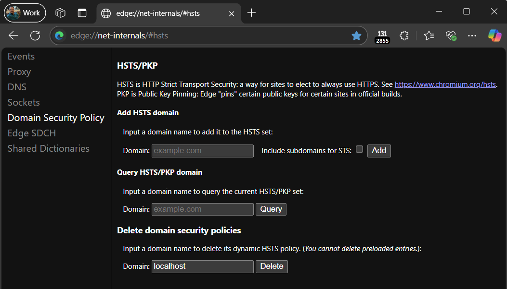

A simple extension that disables [HSTS](https://developer.mozilla.org/en-US/docs/Web/HTTP/Headers/Strict-Transport-Security) for localhost on every response.

You can install from the [Chrome Web Store](https://chromewebstore.google.com/detail/no-local-hsts/cmgiimeeiiafogicmaimbgmfckmfimfd).

This helps prevent unexpected use of HTTPS for developers building a
mix of HTTP and HTTPS services.

See e.g. https://issues.chromium.org/issues/41251622 and
https://textslashplain.com/2020/02/26/can-i-in-the-new-edge/#:~:text=HSTS%20for%20localhost%20sites for discussion.

Note: This extension will remove any HSTS Record for localhost each time a `https://localhost/*` request is made. However, without such a HTTPS request, it cannot itself delete a HSTS rule that was set before the extension was installed. To manually delete any existing record, visit about://net-internals/#hsts, type `localhost` in the **Delete domain security policies** box, and click the **Delete** button:

